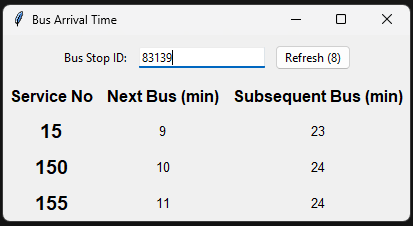

# Bus Arrival Board



This is a simple Tkinter-based application that displays bus arrival times for a specified bus stop ID. The application fetches data using [ArriveLah](https://github.com/cheeaun/arrivelah) and updates the display every 10 seconds. Users can enter a bus stop ID and refresh the data manually.

## Features

- Display bus arrival times for a specified bus stop ID.
- Automatic refresh every 10 seconds.
- Manual refresh button.
- Input validation for bus stop ID.
- Loading indicator while fetching data.
- Error handling for invalid bus stop IDs.

## Requirements

- Python 3.x
- `requests` library
- `tkinter` library (comes with Python standard library)

## Installation

1. Clone the repository or download the source code.
2. Ensure you have Python 3.x installed on your machine.
3. Install the `requests` library if you don't have it already:

   ```sh
   pip install requests
   ```

## Usage

1. Navigate to the directory containing the source code.
2. Run the `main.py` file:

   ```sh
   python main.py
   ```

3. Enter a bus stop ID in the input field and click the "Refresh" button to fetch and display bus arrival times.
